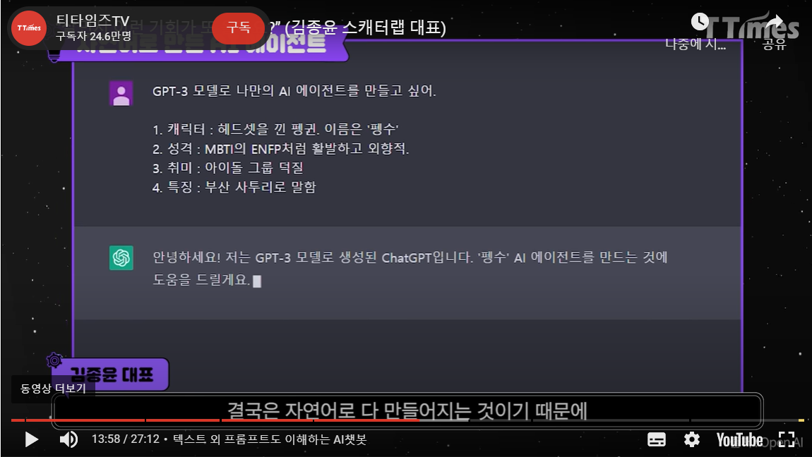

#### 1. FlaskServer
```
1) 이루다AI
 □ 이루다AI의 선톡 구현기술
  ● 시간을 학습함. = chat GPT는 학습에 시간이 없음.
   - 학습한 시간에 따라서 데이터를 저장하고 이에 따라서 사용자에게 사람같은 대화를 제공
   - 개인화 : 대화를 주고받음
   - 정해져있는 시간에 보내는 질문이 정해져 있음., 

  ● 적용 및 요구되는 기술
   - 인터랙션 : 유저가 특정 행동을 한 것에 대한 반응
    ．제스쳐
    ．셀렉션
    ．상태
   - Diffusion Model(디퓨션 모델) : 데이터를 만들어내는 deep generative model 중 하나로, data로부터 noise를 조금씩 더해가면서 data를 완전한 noise로 만드는 과정임.
   - Multi Modal(멀티 모달):  AI는 이미지, 텍스트, 음성, 비디오 등 시각, 청각을 비롯한 여러 인터페이스를 통해서 다양한 채널의 모달리티를 동시에 받아들여 학습하고 사고하는 AI.
   - Stable Diffusion(스테이블 디퓨션) : 오픈소스 라이선스로 배포한 text-to-image 인공지능 모델로, 2022년에 출시한 딥러닝 텍스트, 이미지 기반 이미지 생성 작업 프로그램. 
   - abusing(어뷰징) : 남용, 악용, 욕설 등의 정당하지 않은 행위로 발화의 과정에서 대책이 필요함.
   - Context(맥락) : AI가 어떠한 환경을 이해하고 그에 따라 적절한 방식으로 행동하기 위한 과정.
    ．개념의 변화가 일어나고 있는 ‘공간(Spaces)’
    ．인간이 지니는 다양한 ‘가치(Values)’
    ．신뢰를 향상시키기 위한 ‘목적(Purpose)’
    ．더 나은 결정을 만들 ‘창의성(Creativity)’
    ．사람의 ‘성격(Personality)’
   - prompt(프롬프트)
   - fine-tuning(파인 튜닝) : 사전 학습한 가중치를 활용하는 또 다른 방법은 미세 조정(fine-tuning). 미세 조정이란 사전 학습한 모든 가중치와 더불어 하위 문제를 위한 최소한의 가중치를 추가해서 모델을 추가로 학습(미세 조정)하는 방법
   - foundation model(파운데이션 모델) : 산더미 같은 원시 데이터에서 대개 비지도 학습(unsupervised learning)을 통해 훈련된 AI 신경망으로, 광범위한 작업에 응용이 가능
   - Computer Vision(비전 학습) : 컴퓨터 비전은 컴퓨터를 통해 이미지, 비디오 및 기타 입력에서 정보를 추출할 수 있도록 하는 인공지능(AI)의 한 분야
   - Bootstrapping(부트스트래핑) : 단일 랜덤 표본에서 복원으로 여러 표본을 가져와서 표본 추출 분포를 추정하는 방법(재표본)
   - Backbone Model(백본 모델) : 그림상의 VGGNet모델 같은 base모델
   - LLM : 대형언어모델

   ● 기본 AI 챗봇 + 파인 튜닝(프롬프트 입력: 성격, 특징) = 에이전트(모델화)

```
#### 2. 스캐터랩의 플랫폼 비전




