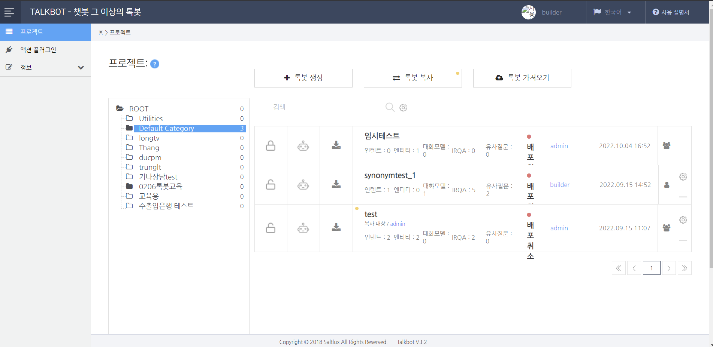

#### 2023.04.13

### 1. TALKBOT (챗봇) : 
객체를 찾는것 = entity
의도를 파악하는 것 = intent


#### 1) 챗봇
```
  (1) 자연어의 이해 (NLU : Natural Language Understanding)
  (2) 톡봇의 기반구축 : 인텐트/액션 = 대화모델(대화흐름) = 비즈니스 로직 = QA
    □ 사용자의 의도파악 : 인텐트/액션
     ● 사용자와의 학습정보에 대한 QA 진행 중, 갑작스러운 오늘의 날씨를 문의해올 경우 등
    □ 비즈니스 로직
    □ 지식 질의
  (3) 인텐트 : 사용자 대화 내용 속에 포함된 의도와 목적을 파악하는 속성
    □ 인텐트를 포함하고 있는 문장을 "발화(uttenance)"라고 함
    □ 엔티티 : 인텐트 = (필수_엔티티#1) + (필수_엔티티#2) + (옵션_엔티티#1)...
     ● 예시: 소회의실 예약 인텐트) 위치 : 소회의실 / 요일 : 수요일 / 참석인원 : 4명
  (4) 대화흐름과 대화모델(Dialog Model)
    □ 대화모델 = 대화흐름을 시스템화
     ● Mission Task를 찾아가는 과정
  (5) 슬롯 필링 
```
#### 2) 챗봇의 종류
```
  (1) 시나리오형 챗봇 : 정해져있는 QA에 따라 간단한 정보를 나누는 챗봇
  (2) 목적지향형 챗봇 : 
  (3) 오픈도메인 챗봇 : 

```
#### 3) 플러그인 (Plug In) : 개발자들이 주로 근무함
```
  (1) 개념 : Open API, DBMS 등 외부 시스템과의 연동을 위한 SW 개발 및 대화모델 연계 가능
  (2) 플러그인을 통해 톡봇 API 서버 ~~ Local 연결~~~
  (3) 주로 사용하는 언어 : Java Script, Python, JAVA
    □ 플러그인을 빌더에서 액션 메뉴 선택 후 JS나 python으로 개발해 톡봇으로 연동하는 등
```

#### 4) 스마트 카드 (Smart Card) : 사용자가 보는 톡봇 대화창에 동적으로 디자인 된 형태의 시스템 답변을 제시하는 경우 사용되는 기능
```
  (1) 자료구조 : Simple Text -> return(text) 
    - return은 json형태로 들어옴.
    - 화면 구성은 랭글러를 통해 동적으로 구성함
```

#### 5) 챗 클라이언트 : 사용자가 보는 톡봇 대화창에 디자인된 형태의 시스템 답변을 제시하는 경우 사용함.
```
  (1) 챗 클라이언트 유형
    - 웹방식
    - 봇인앱
    - 채널변경
```

#### 6) 주요 개념 : 채널 (Channel) : 카카오톡, 페이스북 등 다양한 메신져 채널과 톡봇 대화서버의 연동 가능.
```
```
#### 7) 주요 개념 : 봇 그룹 (Bot Group) / 봇인봇 (Bot in Bot)
```
  (1) 봇 그룹 : 여러 봇을 하나의 그룹으로 구성
    - 여러 단위 봇을 하나의 가상 봇으로 그룹화
    - 기 구축봇을 그대로 재사용 할 수 있는 잇점이 존재함
  (2) 봇 인봇 : 대화 모델 스텝에서 다른 봇을 호출
    - 봇 대화모델의 스텝 단계에서 다른 봇을 호출
    - 호출된 봇이 종료된 이후 기존 봇의 스텝으로 복귀
  (3) 단위 업무 봇, 단위 비즈니스 봇, 서비스 봇 등으로 봇 대화모델 구축 생산성을 높임.
    - 단위 업무 봇 : 로그인 봇 / 결제 봇 등 단
    - 단위 비즈니스 봇 : 시작 / 로그인 / 호텔예약 / 주문 / 결제 등
    - 서비스 봇 : 여러 비즈니스 봇을 합쳐놓은 형태
```
#### 8) IRQA (, 검색기반 질의) : 사용자의 질문과 동일한 형식으로 구성된 질문에 준비된 답변을 제공
```
  (1) 기능 : 문단셋을 사전에 구축하고 준비된 답변을 반환하는 형식임.
  (2) 문제점 : 질문들간의 연관관계를 매칭할 수 없어서, 고도화 될수록 답변 정확성이 떨어짐
```
#### 9) KBQA ( ,심층질의) : 사용자의 질문을 분석하고 여러 지식의 통합과 추론으로 답을 주는 시스템
```
  (1) 지식학습
  (2) 복합추론
   - 객체에 따른 정확율과 데이터량간의 관계 
```

#### 10) 톡봇의 동작 흐름 (예시: 아담)
```
  (1) 인텐트 분류 : 분류모델 사용
  (2) 엔티티 식별(추출) : NLU(개체명 인식) 사용 
  (3) 슬롯 필링 : 
  (4) 액션(화행) : 백엔드 시스템 : 인텐트/엔티티 식별과 API 연동
  (5) 질의/응답
  (6) 피드백
```

#### 11) 아담 톡봇을 활용한 대화형 서비스 구성
```
  (1) 아담 톡봇을 활용한 프로젝트 수행 절차
    □ 1. 착수 및 계획수립 단계
     ● 구축 계획 수립 
    □ 2. 실행 및 통제단계
    □ 3. 종료 단계
  (2) 톡봇 빌더를 활용해 대화 시나리오를 구축
    □ 톡봇 빌더(도구)를 활용해 대화 시나리오를 입력
     ● 계획 준비 : 톡봇 API 서버
     ● 만들기(인텐트) : 인텐트 정의 및 파악을 위해 문장을 입력, 인텐트 식별용 문장의 엔티티 정의, 
      - 인텐트 설계 시 고려 사항 : 분류모델을 만드는 것과 유사하므로, 인텐트 겹침 / 단순한 인텐트 / 인텐트간의 구분 등 속성을 고려해야 함.
      - 객체지향을 고려해 엔티티를 설계해야함 : DB 모델링, 온톨로지 모델링, 객체지향 설계
    ● 만들기(대화흐름) : 대화흐름 정의 및 시나리오를 시스템에 입력 / 분기조건, 처리기능, 슬롯 필링, Task 정의
    ● 만들기(플러그인) : (액션단계)Python, Java Script, Java를 활용한 플러그인 개발 지원 : 스크립트 등록, 스크립트 개발
    ● 대화모델 시험 : 만들어진 시나리오를 빌더 내에서 대화모델 테스트 화면으로 검증함.
    ● 대화모델 배포 : 대화 서비스 시스템으로 데이터 배포 
    ● 대화모델 운영/평가
  (3) 대화모델 만들기 : 
    □ 챗봇의 형태 : 정보제공 / 개인 비서 / 전자상거래 연계서비스 / 교육 / 게임 / 소셜미디어 
```
#### 12) 아담 톡봇 실습


```
  (1) 톡봇 메뉴탭
    □ 프로젝트
    □ 메세지
    □ 인텐트
    □ 유의어
    □ 액션
    □ 대화모델
    □ IRQA
    □ 성능 테스트
    □ 연계
    □ 배포
    □ 모니터링
    □ 비즈니스 인텔리전스
```