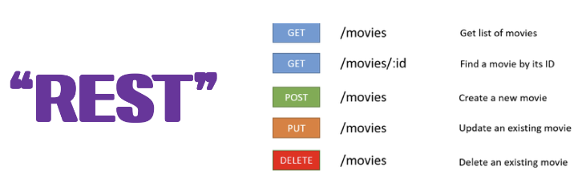
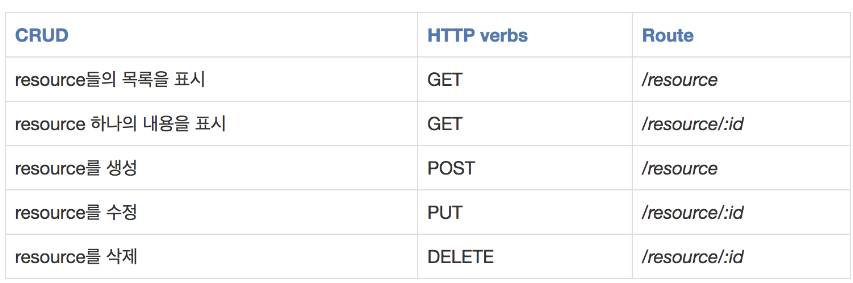
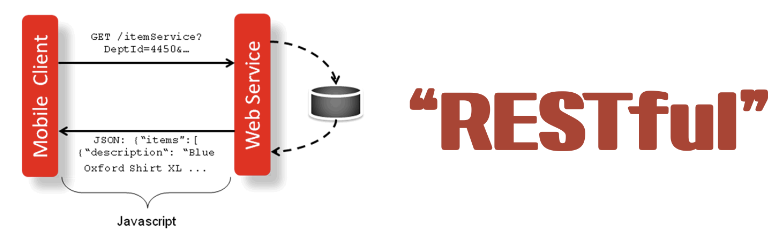

#### 2023-04-18

### 1. REST(Representional State Transfer)
#### 1) REST

```
  (1) 정의
    □ 자원을 이름으로 표현하고 이들을 구분해 해당 자원의 상태(정보)를 주고받는 모든 것을 의미함.
    □ 자원(Resource)의 표현(Repersention)
     ● 자원 : 해당 소프트웨어가 관리하는 모든 것 (문서, 그림, 데이터, 소프트웨어 자체 등)
     ● 자원의 표현 : DB의 학생정보가 자원일 경우, 'student'를 자원의 표현으로 정의하는 등
    □ 상태(정보) 전달 
     ● JSON 혹은 XML를 통해 데이터를 주고받는 방식 (일반적인 방식임)
     ● 데이터가 요청되어지는 시점에서 상태(정보)를 전달하는 방식
    □ World Wide Web(WWW)과 같은 분산 하이퍼미디어 시스템을 위한 소프트웨어 개발 아키텍처의 한 형식
     ● REST는 기본적으로 웹의 기존 기술과 HTTP 프로토콜을 그대로 활용하기 때문에, 웹의 장점을 최대한 활용할 수 있는 아키텍쳐 스타일이다.
     ● REST는 네트워크 상에서 Client와 Server 사이의 통신 방식 중 하나이다.

  (2) 개념
    □ HTTP URI(Uniform Resource Identifier)를 통해 자원(Resource)을 명시하고, HTTP Method(POST, GET, PUT, DELETE)를 통해 해당 자원에 대한 CRUD Operation을 적용하는 것을 의미함. 
     ● REST는 자원기반의 구조(ROA, Resource Oriented Architecture) 설계의 중심에 Resource가 있고 HTTP Method를 통해 Resource를 처리하도록 설계된 아키텍쳐를 의미함.
     ● 웹 사이트의 이미지, 텍스트, DB 내용 등의 모든 자원에 고유한 ID인 HTTP URI를 부여한다.
    □ CRUD Operation
     ● Create : 생성 (POST)
     ● Read : 조회 (GET)
     ● Update : 수정 (PUT)
     ● Delete : 삭제 (DELETE)
     ● HEAD : header 정보 조회 (HEAD)

  (3) 장단점
    □ 장점
     ● HTTP 프로토콜의 인프라를 그대로 사용하므로 REST API 사용을 위한 별도의 인프라를 구축할 필요가 없음.
     ● HTTP 프로토콜의 표준을 따름 : HTTP표준의 모든 플랫폼 사용, 여러 추가기능 적용에 용이함.
     ● Hypermedia API의 기본에 충실하며, 범용성을 보장함
     ● 명확한 의도 전달이 가능.
     ● 서버와 클라이언트간의 명확한 역할 분리
    □ 단점
     ● 표준이 존재하지 않음 : ??
     ● 제한적인 메서드 : 4가지(C,R,U,D) : HTTP Method의 형태가 제한적임.
     ● 지원이 어려운 구형 브라우저 : PUT, DELETE, pushState를 지원하지 않음.

  (4) REST의 필요성
    □ 애플리케이션의 분리 및 통합
    □ 다양한 클라이언트에 적용이 가능한 편리성
    □ 멀티 플랫폼에 대한 서비스 지원 : Web Server는 다양한 브라우저와 Android, iOS 등 모바일 디바이스에서도 통신이 가능해야함.

  (5) 구성요소
    □ 자원(Resource) : URI
     ● 모든 자원에 고유한 ID가 Server에 존재함.
     ● 자원을 구별하는 ID는 HTTP URI (예시: /group/:group_id)
     ● Client는 URI를 이용해 자원을 지정하고 해당 자원의 상태에 대한 조작을 Server에 요청함.
    □ 행위(Verb) : HTTP Method
     ● HTTP 프로토콜의 Method를 사용함 (GET, POST, PUT, DELETE)
    □ 표현 (Representation of Resource)
     ● Client가 자원의 상태(정보)에 대한 조작을 요청하면 Server는 이에 적절한 응답을 보냄.
     ● REST에서 하나의 자원은 JSON, XML, TEXT, RSS 등 여러 형태의 Repersentation으로 나타남.
     ● 주로 JSON과 XML를 통해 데이터를 주고 받음.
    
  (6) 특징
    □ Server-Client(서버-클라이언트 구조)
     ● 자원의 제공자 : Server / 자원의 요청자 : Client
      - REST Server : API를 제공하고 비즈니스 로직 처리 및 저장을 책임짐.
      - Client : 사용자 인증이나 context(세션, 로그인 정보) 등을 직접 관리하고 책임짐.
     ● 상호간의 의존성을 줄임.
    □ Stateless (무상태)
     ● HTTP 프로토콜은 Stateless Protocol이며, REST 역시 무상태성을 갖음.
     ● Client의 context를 Server에 저장하지 않음 : 세션과 쿠키와 같은 context 정보를 신경쓰지 않고 단순한 구현이 가능함.
     ● Server는 각각의 요청을 완전히 별개의 요청으로 인식하고 처리함
      - 각 API 서버는 Client의 요청만 단순하게 처리함
      - 이전 요청이 다음 요청의 처리에 연관되지 않음.
      - 이전 요청건이 먼저 수행됨.
      - Server의 처리 방식에 일관성을 부여함.
      - 처리의 부담이 줄고, 서비스의 자유도가 높아짐.

  (7) Cacheable (캐시처리가능)
    □ Cache (캐시) : 캐시에 데이터를 저장해 동일한 파라미터로 메서드를 호출한 이력과 반환 결과가 캐시에 존재한다면, 이를 호출함으로써 서버의 부담을 줄이고 성능을 높이는 기술
     ● 대량의 요청을 효율적으로 처리함
     ● REST Server 트랜잭션의 방지로 신속한 응답시간과 성능, 서버의 자원 이용률을 향상시킴. 
    □ HTTP 프로토콜 표준의 인프라인 Last-Modified 태그나 E-Tag를 이용해 캐싱 구현 가능.

  (8) Layered System(계층화)
    □ Client는 REST API Server만을 호출함.
    □ REST Server는 다중 계층으로 구성됨.
     ● API Server는 순수 비즈니스 로직을 수행
      - 유연성 향상 : 보안, 로드밸런싱, 암호화, 사용자 인증 등
      - 확장성, 보안성 향상 : 로드밸런싱, 공유 캐시
     ● PROXY, 게이트웨이 같은 네트워크 기반의 중간 매체를 사용할 수 있음.

  (9) Code-On-Demand(optional)
    □ Server로부터 스크립트를 받아 Client에서 실행함. (옵션 기능임)

  (10) Uniform Interface(인터페이스의 일관성)
    □ URI로 지정한 Resource에 대한 조작을 통일되고 한정적인 인터페이스로 수행함.
    □ 특정 언어나 기술에 종속되지 않고, 모든 플랫폼에서 사용이 가능함.

``` 
#### 2) REST API
```
  (1) 개념
    □ API(Application Programming Interface)
     ● 데이터와 기능의 집합을 제공해 컴퓨터 프로그램간 상호작용을 촉진해 서로 정보를 교환가능 하도록 함.
    □ REST API의 정의
     ● REST 기반으로 서비스 API를 구현한 형태임 (OpenAPI가 주로 해당 형태임) 

  (2) 특징
    □ 사내 시스템들도 REST 기반의 시스템을 분산해 확장성과 재사용성을 높여 유지보수 및 운용에 용이함
    □ REST는 HTTP 표준을 기반으로하여 범용성을 가짐
     - REST API를 제작하면, 델파이 클라이언트뿐 아니라 자바, C, 웹 등을 이용한 클라이언트를 제작할 수 있음

  (3) 설계 기본 규칙
    □ 참고 리소스 원형
     ● 도큐먼트 : 객체 인스턴스나 데이터베이스 레코드와 유사한 개념
     ● 컬렉션 : 서버에서 관리하는 디렉터리 
     ● 스토어 : 클라이언트에서 관리하는 리소스 저장소
    □ URI는 정보의 자원명 표현법 (작명 규칙)
     ● Resource Name : 소문자 명사를 사용
     ● 도큐먼트 Name : 단수 명사
     ● 컬렉션 Name : 복수 명사
     ● 스토어 Name : 복수 명사
    □ HTTP Method의 표현법
     ● URI에 Method가 들어가선 안됨
      - DELETE / board/ 1
     ● URI에는 명사 표현만 작성함.
      - GET / members / 1
      - POST / boards / 1
     ● 경로 부분 중, 변하는 부분은 유일한 값으로 대체함
      - POST / students
      - DELETE / students / 12 

  (4) 설계 규칙
    □ 슬래시 구분자(/)는 계층관계를 나타내는데 사용함.
     ● http://abcde.com/members/nomal
    □ URI 마지막 문자로 슬래시(/)는 포함하지 않음.
    □ 하이픈(-)은 URI의 가독성을 높이는데 사용함.
    □ 로우바(_)는 URI에 사용하지 않음.
    □ URI 경로에는 소문자를 사용
    □ 파일 확장자는 URI에 포함하지 않음
     ● Accept header를 사용
      - http://restapi.example.com/members/soccer/345/photo.jpg (X)
      - GET / members/soccer/345/photo HTTP/1.1 Host: restapi.example.com Accept: image/jpg (O)
    □ 리소스 상호간에 연관관계가 존재하는 경우
     ● /리소스명/리소스ID/관계가 있는 리소스명
      - GET: /members/{memberid}/devices → 일반적으로 소유'has'의 관계를 표현하는 방법

  (5) 설계 예시
```

```
```
  (6) HTTP 응답상태 코드
    □ 1XX : 전송 프로토콜 수준의 정보 교환
    □ 2XX : 클라이언트 요청이 성공적으로 수행됨
    □ 3XX : 클라이언트는 요청을 완료하기 위해 추가적인 행동을 취해야 함.
    □ 4XX : 클라이언트의 잘못된 요청
    □ 5XX : 서버쪽 오류로 인한 상태코드
```
#### 3) RESTful

```
  (1) 정의
    □ REST 아키텍쳐를 구현하는 웹 서비스를 나타내기 위한 용어
     ● REST API를 제공하는 웹 서비스를 RESTful 하다고 지칭하고 이와 같은 원리를 따르는 시스템을 뜻함.

  (2) 목적
    □ RESTful한 API를 구현하는 근본적인 목적이 성능 향상에 있는 것이 아니라 일관적인 컨벤션을 통한 API의 이해도 및 호환성을 높이는 것이 주 동기임.
    □ 성능이 중요한 상황에서는 굳이 RESTful한 API를 구현할 필요는 없음.

  (3) RESTful 하지 못한 상황
    □ CRUD를 POST로만 처리하는 API
    □ rotue에 resource, id 외의 정보가 들어가는 경우
     ● (/student/updateName)
```