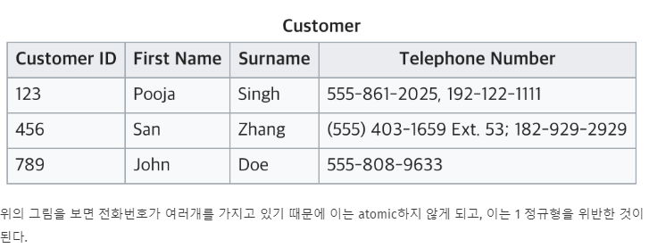
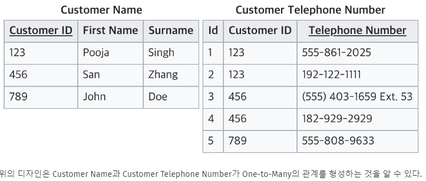

#### 2023.04.14
### 1. DB설계 (ERD)

#### 1) 테이블 설계
```
    1) 관계형 DB : SQL DB, Tabular DB
     □ 자료구조 : 표(table) + 입출력 명령(SQL)
     □ 여러 테이블의 데이터를 모아서 웹페이지를 이루는데, 
     □ Structured Data : 표와 같은 구조가 있는 형태

    2) 비관계형 DB : NoSQL DB → MongoDB, Cassandra, ...
     □ 자료구조 : JSON, KV, List, ... + 입출력 명령(독자적인 명령)
     □ Unstructured Data : 음성, 이미지와 같은 형태

```
#### 2) Data Types
```
    1) 구조에 따른 Data 타입 분류
     □ Simple Structured Data 
     □ Complex Structured Data 
     □ Semistructured Data 
     □ Unstructured Data : 음성, 이미지와 같은 형태
    

    2) Column

    3) 식별자(Identification)
     □ 테이블의 하나 이상의 컬럼을 조합했을 경우, 식별자의 구분이 필요함 (PK, FK 등)
     □ 예시) 주민등록번호 : 앞자리 컬럼, 뒷자리 컬럼을 중복되는 번호 
     □ PK, Not null, 

```
#### 3) 정규화 (Nomalization)
```
    1) 정의
     □ 관계형 데이터베이스에서 설계의 중복을 최소화하는 데아터의 구조화 프로세스
     □ 정규화의 순서에 대한 개념은 존재하지 않음(제1,2,3, ... 정규화)

    2) 정규화 방법 : EF Code에서 제시한 방법
     □ 제 1정규화(First Normal Form, 1NF)
```

```     
      ●  Attribute에서 반복되는 그룹(Repeating Group)을 해결함
      ●  Customer ID를 FK값으로 reference한 테이블을 인공키 식별자(id)를 추가해 정규화 수행 : 식별자는 아무런 의미가 없는 값을 PK로 잡는 것이 효과적임
      ● 효과적인 이유
       - 예시) A학교의 학번/B학교의 학번의 통폐합 →   
       - 예시) 전화번호와 같이 의미있는 값을 PK로 잡는 경우, 해당 테이블을 reference해 생성된 테이블 수정에 어려움이 생길 수 있음.
```


```      
     □ 제 2정규화(Second Normal Form, 2NF)
     □ 제 3정규화(First Normal Form, 1NF)             
     □ 제 1정규화(First Normal Form, 1NF)    
     □ 제 1정규화(First Normal Form, 1NF)        
     □ 제 1정규화(First Normal Form, 1NF)    

    3) 

```
#### 4) 반정규화 (Nomalization)
```
    1) 정의

    2) 반정규화 방법 : EF Code에서 제시한 방법
     □ 
    

    3) 

```

#### 4) ERD 설계
```
    1) 실습 Tool : Oracle SQL Developer Data Modeler
    1) 프로세스
     □ 1. 기본 전제 : 모든 Cell에는 한 종류의 값 하나만 들어가게 함.
     □ 2. 정규화가 수행되지 않은 상태로 작성함.
     □ 3. 정규화 수행 : 원칙이 정해짐.
     □ 4. 반정규화 수행 : 원칙에 정해져 있지 않음.

    2) 
     □ 
    

    3) 

```