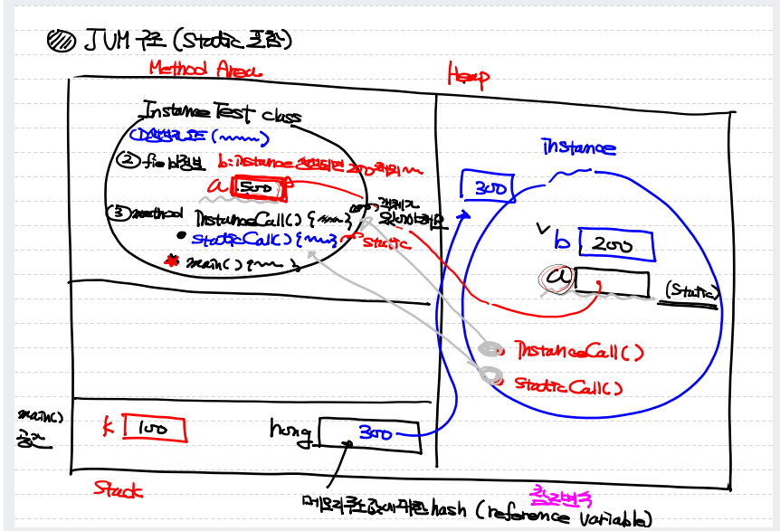

#### 2022.12.20

### 1. JAVA 기초 정리 
#### 1) 변수(Variable) : 데이터 값이 메모리에 저장되는 공간의 의미.
```
  (1) 초기화: 변수를 선언하고 값을 저장한 변수
  (2) 재할당: 초기화 이후 변수의 값을 다시 저장
  (3) 맴버변수 
    □ 클래스변수: static을 사용한 변수 (힙 영역 저장)
    □ 인스턴스 변수: 일반적으로 사용하는 변수 (힙 영역)
  (4) 지역변수 : 메서드 안이나 {} 작동하는 변수 (스택)
``` 
#### 2) 패키지 : 클래스의 그룹화 단위
```
  (1) 구성요소
    □ 생성자 : 클래스명과 같은 이름의 메서드
    □ 메서드 : 클래스의 기능을 구현
      ● 지역 내부 클래스: 메서드 안에 만들어진 메서드 내에서만 사용하는 클래스
    □ 이너클래스 : 클래스 안에 클래스를 하나 더 만듦
    □ 필드 : 클래스 내에 존재하는 변수, 상수
      ● 클래스명 앞에 final(상수선언)시 상속이 불가능해짐
```
#### 3) 필드 : 클래스에 포함된 변수 : 필드 선언시 element = 0
```
  (1) 클래스 변수
  (2) 인스턴스 변수
  (3) 지역 변수
```
#### 4) 객체 : 객체화(힙 영역에 클래스를 복사하고 똑같은걸 하나 더 사용함)
```
  (1) 속성 : 객체의 필드속성
  (2) 기능 : 객체의 메서드 기능
  (3) 멤버 : 속성+기능+이너클래스 멤버
```
#### 5) 메서드 : 기능 구현 함수
```
  (1) 문법: 접근제어자 반환타입 메소드명 (매개변수) {메소드 내용}
  (2) 호출방법: 메소드명 (매개변수)
  (3) 타입
    □ 메인 메서드 : main = Entry Point
    □ 메서드 시그니처 : 접근제어자, 타입, 이름, 변수 등 
    □ 메서드 바디 : 구현부 함수 {}
    □ static 메서드
    □ Instance 메서드
```
#### 6) 멤버 : static + instance
```
  (1) 맴버변수 : 클래스안에 선언된 변수 (클래스+인스턴스)
  (2) 인스턴스맴버 : Class + Variable + Method
  (3) 스태틱 맴버 / 클래스 맴버 : static  클래스+ 변수 + 메소드
  (4) 맴버 내부클래스 : static 이너클래스 + 이너클래스
```
#### 7) 생성자: 클래스 내에 반드시 존재하는 메서드, 필드를 초기화함.
```
  (1) 오버로딩 가능.
  (2) 생성자에 매개변수 있는 경우, 값을 받아 초기화 가능
  (3) 사용법: 클래스타입 변수명 = new 생성자 (인덱스);
    □  this ( ) : 클래스의 default생성자를 호출 한다 this () 를 작성하는 부분의 클래스 생성자this ( ) 는 생성자 내부에서만 사용이 가능하고 , 메소드의 첫 줄에 위치해야 한다
    □  this.변수명 : 매개변수인지 필드 변수인지 구분하기 위해 작성해준다.this. 를 적으면 필드라는 의미이다.
    □  super : 상위 클래스의 필드를 호출한다 .super ( ) : 상위 클래스의 생성자를 호출 한다 .
```
### 2. JAVA 구성요소


```
  (1) JVM(java virtual Machine -> 프로그램 ( C code로 제작) : 
   Class를 interpret해서 실행하는 주체. = Java class 라이브러리.
  (2) Memory 관리 영역(3가지)
     □ Method Area (클래스 생성자, 필드, 메서드)
     □ Stack (지역변수와 main 메서드)
     □ Heap : Instance 저장되는 공간 =garbage collector
  (3) JRE: 실제  class를 실행하는 가상공간 (실행환경)
  (4) JDK: java Develop Kit : 개발도구
```