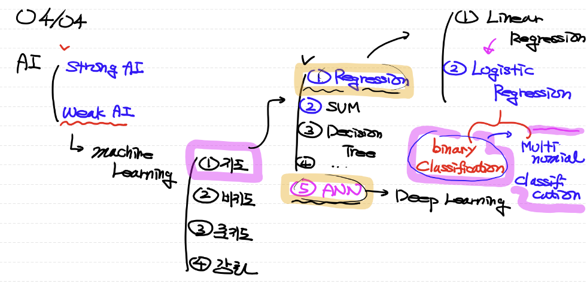
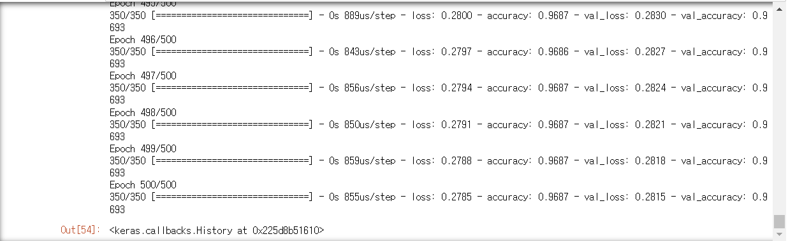

### 2023.04.04

## 1. MultiNomial Classification
  ### 0) AI 복습
   A: 0.7 / B: 0.4 / C: 0.1 => 1.2
  (2) softmax(함수) : 다항분류 들간의 확률값을 도출함. 
  -> A: 0.6 / B: 0.3 / C: 0.1 => 1(총합)

 ### 3) One-hot encoding
   (1) 상위 t_data를 기준으로, 각각의 위치값 형태로 자료구조를 변환함
    □ t -> tA / tB / tC

  ### 4) Model 
  (1) Input Layer
  □ Input Node(2) : 독립변수(feature) : 성적(x1), 출석(x2)
  (2) Output Layer 
  □ Output Node(3) : 각각의 A, B, C 를 이진분류로 예측값인 확률을 구함.
  -> A: 0.7 / B: 0.4 / C: 0.1 => 1.2
  (3) SoftMax 수행
  -> A: 0.6 / B: 0.3 / C: 0.1 => 1
  (4) loss 수행 : CrossEntropy(수식)을 이용함.
  □ 예측값(A,B,C)과 정답(tA,tB,tC)의 차이를 비교
  □ Shape이 일치해야 비교할 수 있음. (One-hot encoding을 사용하는 이유)
  (5) Logistic(Wight / biary)     
 ### ​5) Code 실습 
 ``` python
# 1. 필요한 Module 불러오기
import numpy as np # 2차원 Metrix(행렬) ndarray
import pandas as pd # data handling
# 학습데이터와 테스트데이터를 분리해야함 ( 7:3 / 8:2 분리)
from sklearn.model_selection import train_test_split
#정규화
from sklearn.preprocessing import MinMaxScaler
#우리 데이터에는 결측치와 이상치가 없음.
from tensorflow.keras.models import Sequential
from tensorflow.keras.layers import Flatten, Dense
from tensorflow.keras.optimizers import Adam
# 다중분류 : one-hot encoding 작업이 필요함.
import tensorflow as tf

# 2. Raw Data Loading
df = pd.read_csv('./data/bmi.csv', skiprows=3) # skiprows=n n번째줄까지 skip
display(df.head(), df.shape)

# 결측치와 이상치는 따로 존재하지 않는 DataSet임.

# 3. 데이터 분리 : 학습데이터(train, test) / 테스트데이터(train, test)
#tuple이라 ()괄호는 통상적으로 생략해서 사용함.
# 데이터 분리 함수 -> Fancy indexin
x_data_train, x_data_test, t_data_train, t_data_test=\
train_test_split(df[['height', 'weight']].values,
                df['label'].values,
                test_size=0.3) 
print(x_data_train, x_data_train.shape)

# 4. 정규화 진행
scaler = MinMaxScaler()
scaler.fit(x_data_train)
x_data_train_norm = scaler.transform(x_data_train)
x_data_test_norm = scaler.transform(x_data_test)
# print(x_data_train_norm, x_data_test_norm.shape)

# 5. One-hot 처리
# print(t_data_train) # 현재 1차원이므로 One-hot을 통해 2차원으로 변경
# depth는 class의 수=> 분류의 개수
t_data_train_onehot = tf.one_hot(t_data_train, depth=3).numpy()
t_data_test_onehot = tf.one_hot(t_data_test, depth=3).numpy()

# 6. Model
model = Sequential()

# Layer 추가 (input, output)
model.add(Flatten(input_shape=(2,)))
model.add(Dense(3, activation='softmax'))

# model 설정
model.compile(optimizer=Adam(learning_rate=1e-4),
             loss='categorical_crossentropy',
             metrics=['accuracy'])

# 7. model 학습
model.fit(x_data_train_norm,
         t_data_train_onehot,
         epochs=500,
         validation_split=0.2,
         verbose=1)
```




```python
# 결과에서 앞의 loss 값은 예측치와 결과값과의 비교 차이이므로, 작아질 수록 좋은 값임.
# 하지만, 학습한 데이터 내에서만 진행된 loss 값이므로, 의미가 없는 데이터 값임.
# 따라서, val_loss(낮을수록 GOOD) 와 val_accuracy(높을수록 GOOD)를 확인해야함.

# 8. Model evaluation (모델 평가)
print(model.evaluate(x_data_test_norm, t_data_test_onehot))

# 9. model 사용 : 예측값 도출
predict_data = np.array([[10,1]])
scaled_predict_data = scaler.transform(predict_data)
print(model.predict(scaled_predict_data))

 ```

##  2. MNIST
 ### 1) 정의 : 이미지 데이터셋을 이용한 다중분류 문제  (비정형 데이터 지도학습)
  (1) 예시 : 사람이 손글씨로 쓴 숫자의 이미지 (우체국의 생산성을 위한 우표번호 인식..)
   □ 비정형데이터 : 이미지(언제나 3차원 형태임 => 2차원 이미지가 여러개..)
   ● pixel에 표현하는 방식
  -> 이진픽셀(white and black) : 1개의 값(0 or 1)
  -> R, G, B : 3개의 값
  -> GrayScale(0~255의 값) : 2차원 흑백 (숫자가 높을수록 색상이 진해짐)
    
 ### 2) 실습(손글씨)
  (1) Kaggle : Digit Recognizer
  □ 28 X 28 pixel (total pixel: 784)
  ●

 ### 3) 실습(fashion)

 ### 4) Overfitting : 과적합 현상
  (1) 반복을 많이 하면 발생하는 문제점임
  ㅁ 모델을 만들고 최적화 하는 과정에서 어려운 점


 ### 5) Hidden Layer (Dropout)
  (1) Import Code: from tensorflow.keras.layers import Flatten, Dense, Dropout
  (2) Process
  □ Training Data Set -> Model 
  □ Input Layer

  □ Hidden Layer (Neural Network : NN) = Deep Learning
  ● 행렬곱을 통해 각각의 Node로 전달되고 있음.
  ● 전달되는 과정에서, Layer를 추가하게되면? 중간의 Layer와 행렬곱으로 계산되며 이동하게됨.
  ● 따라서, 각각의 가중치(W)값을 행렬곱으로 수행하도록해서 복잡한 가중치 발생식으로 보다 정확한 값을 도출하게함.
  ● 다만, Overfitting을 조심해야함.

  □ Output Layer


```python

```


