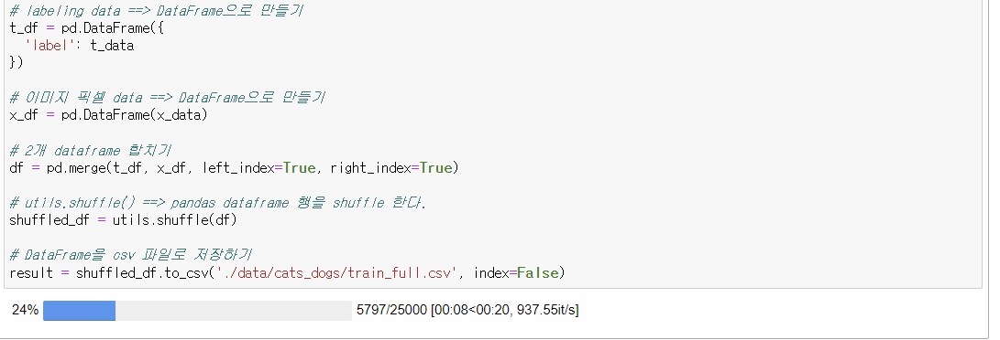
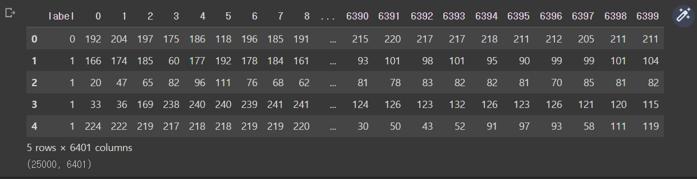
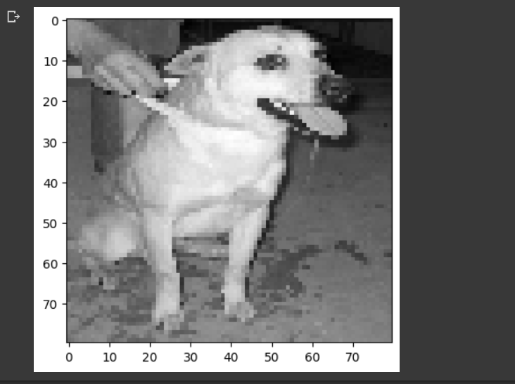
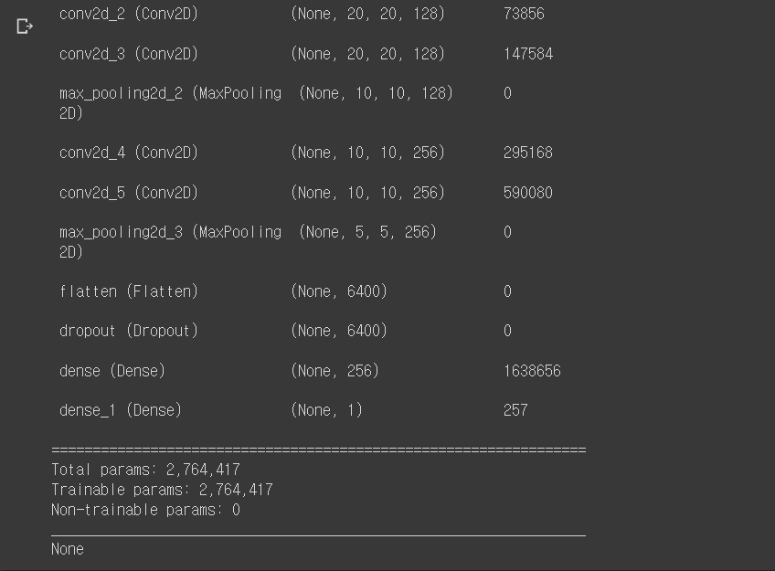
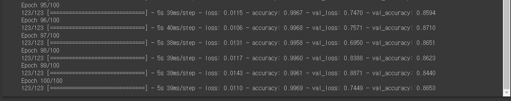
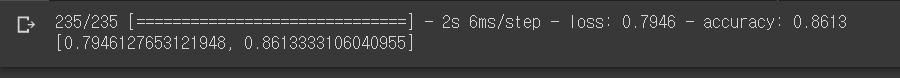
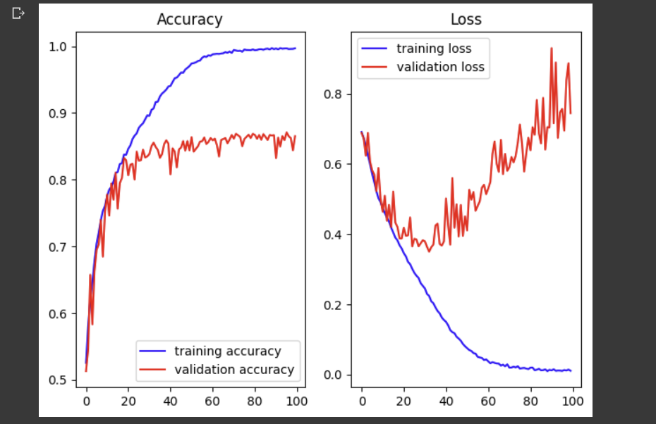

#### 2023.04.06

### 1. ANN(Artificial Neural Network) 인공신경망
  #### 0) AI 복습
```
  (1) Linear Regression : 종속변수가 연속적인 숫자값
    □ 학습데이터의 상태(종속변수)가 변함

  (2) Logistic Regression : 학습데이터의 상태(종속변수)가 다시 변함
    □ binary classification : 0~1사이의 확률값 1개가 도출됨.

  (3) Multinomial Classification (정확도 : 92%)
    □ class별 확률값이 도출됨(1=> 0.6 / 0.3 / 0.1)

  (4) 비정형 Data 학습 → DNN (정확도 : 95%)
  
  (5) 비정형 Data 학습 → CNN (정확도 : 98%)
    □ Image의 경계선 (swap?)
    □ MNIST 
    □ Image 인식의 최고봉 
```   
  #### 1) CNN (Convolutional Neural Network) : 합성곱 신경망 → Convnet(컨브넷)
```
  (1) 실사이미지 딥러닝
    □ 예제파일 : Dogs VS Cats 예제는 우리에게 주어진 image File by kaggle
      ● 총 25,000장(dog: 12,500/ cat: 12,500)
    □ Process
      ●  Module 설치 (Anaconda Prompt)
       1) conda install tqdm
       2) conda install -c conda-forge ipywidgets
       3) conda install -c conda-forge opencv
      ● 하나의 file(CSV) 생성 후 local에서 진행 (Jupyter notebook)
       1) 그림파일을 읽어들임
       2) JPG File을 RGB Pixel값으로 decoding
       3) 정규화 진행
```
```python
import numpy as np
import pandas as pd 
from PIL import Image
import matplotlib.pyplot as plt
import random
import os
import cv2 as cv 
from sklearn import utils
from tqdm.notebook import tqdm

# 파일 경로
train_dir = './data/cats_dogs/train/'

# img = 파일 이름
def labeling(img):
    class_name = img.split('.')[0]
    if class_name == 'cat': return 0
    elif class_name == 'dog': return 1
    
# label data와 pixel data 담을 변수
x_data = []
t_data = []

# os.listdir(): 인자로 준 폴더 경로 안에 있는 모든 파일들 이름 리스트                               ):
for img in tqdm(os.listdir(train_dir),
                total=len(os.listdir(train_dir)),
                position=0,
                leave=True):
    # 위에서 만든 labeling()을 통해 이름이 cat이면 0 / dog면 1 반환
    label_data = labeling(img)

    # 이미지 파일 경로 설정
    path = os.path.join(train_dir, img)

    # 이미지 파일 nd.array로 불러오기 (cv2.imread())
    # 형태만 필요해서 흑백으로 불러오기 (cv2.IMREAD_GRAYSCALE)
    # 이미지 pixel size 조정하기
    img_data = cv.resize(cv.imread(path, cv.IMREAD_GRAYSCALE), (80, 80))

    # 리스트 변수에 담아주기
    t_data.append(label_data)
    x_data.append(img_data.ravel()) # 이미지 shape이 2차원: (80,80)
    # 이게 그대로 들어가면 차원 하나 더 있어서 결국 3차원이므로 
    # 1차원으로 바꿔주기: ravel()

# labeling data ==> DataFrame으로 만들기
t_df = pd.DataFrame({
  'label': t_data
})

# 이미지 픽셀 data ==> DataFrame으로 만들기
x_df = pd.DataFrame(x_data)

# 2개 dataframe 합치기
df = pd.merge(t_df, x_df, left_index=True, right_index=True)

# utils.shuffle() ==> pandas dataframe 행을 shuffle 한다.
shuffled_df = utils.shuffle(df)

# DataFrame을 csv 파일로 저장하기
result = shuffled_df.to_csv('./data/cats_dogs/train_full.csv', index=False)
```


```
      ● 실사이미지 딥러닝 수행 (coLab)
````
```python
import numpy as np 
import pandas as pd
import matplotlib.pyplot as plt
import tensorflow as tf
from sklearn.preprocessing import MinMaxScaler
from sklearn.model_selection import train_test_split
from tensorflow.keras.models import Sequential
from tensorflow.keras.layers import Flatten, Dense, Conv2D, MaxPooling2D, Dropout
from tensorflow.keras.optimizers import Adam, RMSprop
import matplotlib.pyplot as plt

# 1. Raw Data Loading
df = pd.read_csv('/content/drive/MyDrive/[파이썬 실습]/cat_dog_full.csv')
display(df.head(), df.shape) # (25000, 6401)

```


```python
# 2. 이미지 데이터(픽셀 정보), 라벨 데이터 
label_data = df['label'].values
img_data = df.drop('label', axis=1, inplace=False).values # 2차원 ndarray

# 3. 샘플 이미지 확인
plt.imshow(img_data[150:151].reshape(80,80), cmap='gray')
plt.show()
```


```python
# 4. data split (7:3)
x_data_train, x_data_test, t_data_train, t_data_test = \
train_test_split(img_data, label_data, test_size=0.3, random_state=0)

# 5. 정규화 처리 pixel data 
scaler = MinMaxScaler()
scaler.fit(x_data_train)
x_data_train_norm = scaler.transform(x_data_train)

scaler.fit(x_data_test)
x_data_test_norm = scaler.transform(x_data_test)

# Model
model = Sequential()

# 이미지 한장당 32번의 filter를 거치면, 1장이 32배로 늘어나는 것, 그리고 polling을 수행해 사이즈를 절반으로 줄임.
# 특징을 뽑아내는 과정 : 이미지 케이스는 증가/데이터 사이즈(이미지 크기)는 감소
model.add(Conv2D(filters=32, 
                 kernel_size=(3,3), 
                 activation='relu', 
                 padding='same', 
                 input_shape=(80,80,1)))
model.add(MaxPooling2D(pool_size=(2,2)))

model.add(Conv2D(filters=64, 
                 kernel_size=(3,3), 
                 padding='same', 
                 activation='relu'))
model.add(MaxPooling2D(pool_size=(2,2)))

model.add(Conv2D(filters=128, 
                 kernel_size=(3,3), 
                 padding='same', 
                 activation='relu'))
model.add(Conv2D(filters=128, 
                 kernel_size=(3,3), 
                 padding='same', 
                 activation='relu'))
model.add(MaxPooling2D(pool_size=(2,2)))

model.add(Conv2D(filters=256, 
                 kernel_size=(3,3), 
                 padding='same', 
                 activation='relu'))
model.add(Conv2D(filters=256, 
                 kernel_size=(3,3), 
                 padding='same', 
                 activation='relu'))
model.add(MaxPooling2D(pool_size=(2,2)))

# Input Layer
model.add(Flatten())

# Dropout Layer
model.add(Dropout(rate=0.5))

# Hidden Layer
model.add(Dense(units=256, 
                kernel_initializer='he_normal',
                activation='relu'))

# Output Layer
# sigmoid = 이진분류
model.add(Dense(units=1, 
                kernel_initializer='he_normal',
                activation='sigmoid'))

print(model.summary())
```

```python
# Optimizer
model.compile(optimizer=RMSprop(learning_rate=1e-4), 
              loss='binary_crossentropy', 
              metrics=['accuracy'])

# Learning
history = model.fit(x_data_train_norm.reshape(-1,80,80,1), 
                    t_data_train.reshape(-1,1), 
                    epochs=100, 
                    batch_size=100, 
                    verbose=1, 
                    validation_split=0.3)
# EarlyStopping은 옵션사항임, 이번 예제에서는 없이 수행함.

```


```python
# Evaluation
print(model.evaluate(x_data_test_norm.reshape(-1,80,80,1), t_data_test.reshape(-1,1)))

```


```python
# 결과 그래프
train_acc = history.history['accuracy']
train_loss = history.history['loss']

validation_acc = history.history['val_accuracy']
validation_loss = history.history['val_loss']

fig = plt.figure()
fig_1 = fig.add_subplot(1,2,1)
fig_2 = fig.add_subplot(1,2,2)

fig_1.plot(train_acc, color='b', label='training accuracy')
fig_1.plot(validation_acc, color='r', label='validation accuracy')
fig_1.set_title('Accuracy')
fig_1.legend()

fig_2.plot(train_loss, color='b', label='training loss')
fig_2.plot(validation_loss, color='r', label='validation loss')
fig_2.set_title('Loss')
fig_2.legend()

plt.tight_layout()
plt.show()
```



````
  (2) 실사이미지 딥러닝 (일부분만 사용해서 학습을 진행함.)
    □ 예제파일 : Dogs VS Cats 예제는 우리에게 주어진 image File by kaggle
      ● 총 25,000장(dog: 12,500/ cat: 12,500)
      ● 학습량 : 4,000장
    □ Process
      ● ...
````
````
  (3) 현실적으로 부족한 Data로 학습하는 경우 좋은 결과를 도출하는 2가지 방법
    □ Augmentation(증식)
      ● data가 많을수록 Overfiting이 발생하지 않으므로, data는 다다익선
    □ Process

````
  #### 3) Augmentation (증식)
````
  (1) Image 처리
    □ 회전, crop, 확대, 축소
    □ 좌, 우, 위, 아래 이동

  (2) ImageDataGenerator(증식의 기능을 가지고 있는 속성)

````
